# 在centos服务器上面部署jenkins

## 1.CentOS安装Docker

### 1.1.卸载（可选）

如果之前安装过旧版本的Docker，可以使用下面命令卸载：

```shell
sudo yum remove docker \
                  docker-client \
                  docker-client-latest \
                  docker-common \
                  docker-latest \
                  docker-latest-logrotate \
                  docker-logrotate \
                  docker-engine
```


### 1.2.设置docker yum源（二选一）
设置为阿里云的源速度可以快一点（推荐）

```shell
sudo yum install -y yum-utils
sudo yum-config-manager \
--add-repo \
http://mirrors.aliyun.com/docker-ce/linux/centos/docker-ce.repo
```


### 1.3.安装docker

```bash
sudo yum install docker-ce docker-ce-cli containerd.io docker-buildx-plugin docker-compose-plugin
```


### 1.4.启动docker

```shell
sudo systemctl start docker
```


### 1.5.设置开机自启动

```shell
sudo systemctl enable docker
```


### 1.6.查看docker版本和docker相关信息

```shell
docker -v
docker info
```


### 1.7.配置docker的镜像

```shell
# 进入docker目录
cd /etc/docker/

# 进入镜像配置文件
vim /etc/docker/daemon.json
```

配置镜像：

```shell
{
"registry-mirrors": [
    "https://docker.1panel.live",
    "https://image.cloudlayer.icu",
    "https://hub.fast360.xyz",
    "https://docker-0.unsee.tech"
  ]
}
```

重启Docker`systemctl restart docker`


## 2.docker安装jenkins

### 2.1.拉取jenkins镜像

```shell
docker pull jenkins/jenkins:2.528.2-lts
```


### 2.2.创建并启动jenkins容器

```shell
docker run -d \
  --name jenkins-container \
  -p 8080:8080 \
  -p 50000:50000 \
  -p 8081:8081 \
  -p 8082:8082 \
  -p 30000-40000:30000-40000 \
  -v jenkins_home:/var/jenkins_home \
  jenkins/jenkins:2.528.2-lts
```


常用参数说明：

- **`-d`**: 后台运行容器并返回容器 ID。
- **`-it`**: 交互式运行容器，分配一个伪终端。
- **`--name`**: 给容器指定一个名称。
- **`-p`**: 端口映射，格式为 `host_port:container_port`。
- **`-v`**: 挂载卷，格式为 `host_dir:container_dir`。
- **`--rm`**: 容器停止后自动删除容器。
- **`--env` 或 `-e`**: 设置环境变量。
- **`--network`**: 指定容器的网络模式。
- **`--restart`**: 容器的重启策略（如 `no`、`on-failure`、`always`、`unless-stopped`）。
- **`-u`**: 指定用户。


## 3.jenkins容器安装python

### 3.1.进入jenkins容器

```shell
docker exec -it -u root jenkins bash
```


### 3.2.更新系统并安装依赖

```shell
apt-get update
apt-get install -y \
    wget \
    build-essential \
    zlib1g-dev \
    libncurses5-dev \
    libgdbm-dev \
    libnss3-dev \
    libssl-dev \
    libreadline-dev \
    libffi-dev \
    libsqlite3-dev \
    libbz2-dev
```


### 3.3.下载并编译Python 3.9

```shell
cd /tmp
wget https://www.python.org/ftp/python/3.9.18/Python-3.9.18.tgz
tar -xf Python-3.9.18.tgz
cd Python-3.9.18

./configure --enable-optimizations
make -j $(nproc)
make altinstall
```


### 3.4.验证安装

```shell
python3.9 --version
pip3.9 --version
```

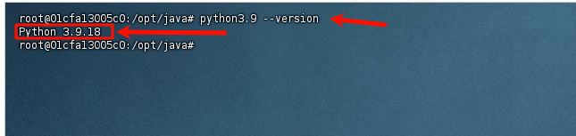


## 4.jenkins容器安装jdk21

```shell
# 更新包列表
apt-get update

# 安装OpenJDK 11
apt-get install -y openjdk-21-jdk

# 验证安装
java -version
javac -version

# 检查安装位置
which java
echo $JAVA_HOME
```


## 5.jenkins容器安装allure

### 5.1.jenkins安装allure

```shell
# 进入Jenkins容器
docker exec -it -u root jenkins bash

# 下载Allure
cd /tmp
wget https://github.com/allure-framework/allure2/releases/download/2.27.0/allure-2.27.0.tgz

# 解压安装
tar -xvzf allure-2.27.0.tgz -C /opt/
mv /opt/allure-2.27.0 /opt/allure

# 创建软链接
ln -s /opt/allure/bin/allure /usr/local/bin/allure

# 验证安装
allure --version
```


## 6.在jenkins中所需要安装的插件

### 6.1.**allure**：用于生成测试报告

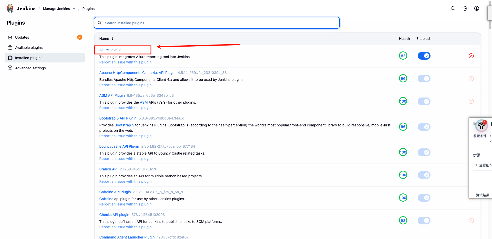

### 6.2.**git：**git插件，拉取代码

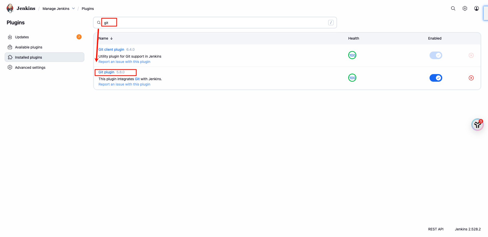

### 6.3.**timestamper**：控制台打印输出时间

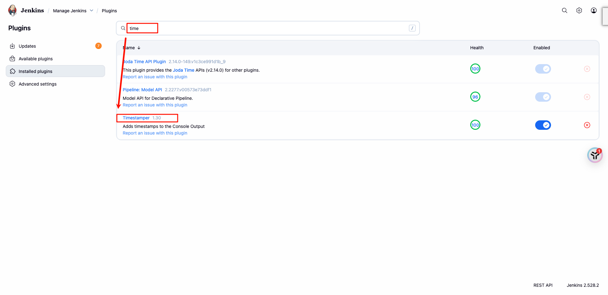

### 6.4.**Credentials Binding**：凭据管理

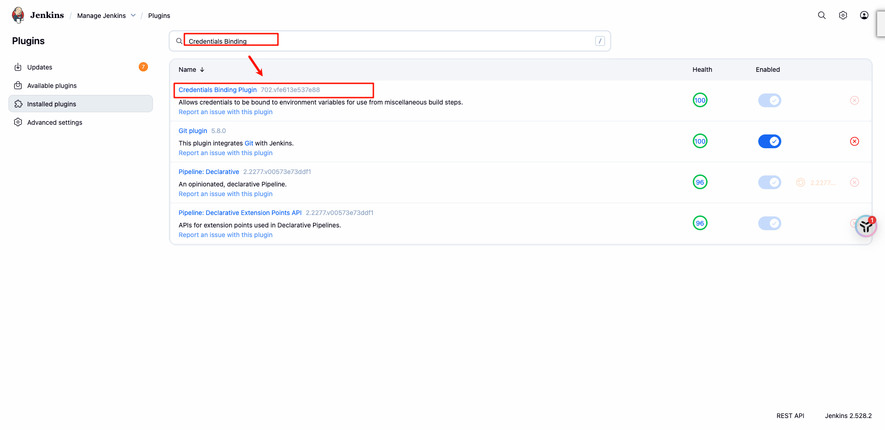

## 7.jenkins系统配置

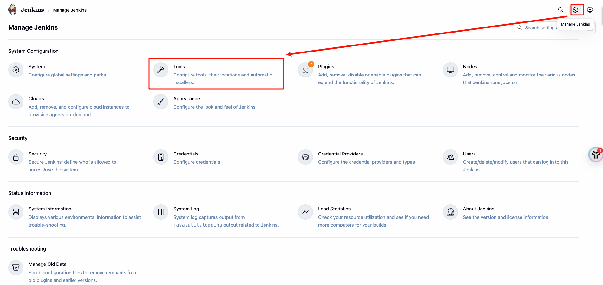

### 7.1.jenkins配置jdk

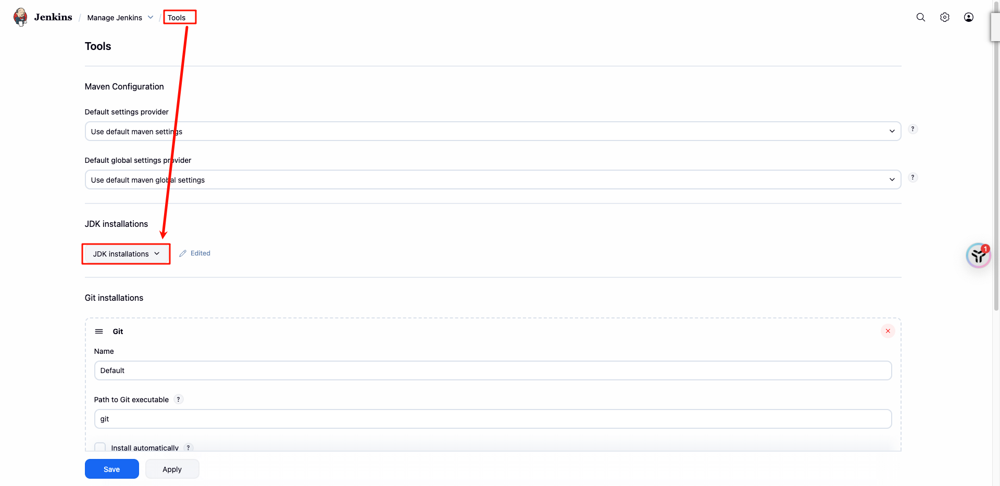

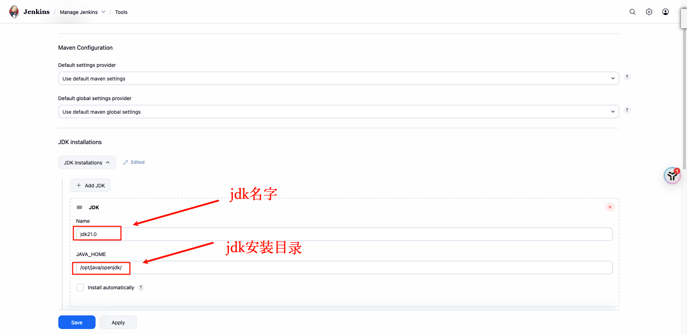

> tips：输入的java_home不包含bin目录
>
> 如果忘记了安装的jdk在哪了，可以输入命令`which java`查看，如下图所示：
>
> 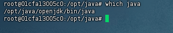


### 7.2.Git使用默认配置

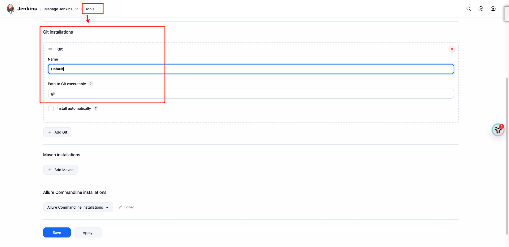


### 7.3.配置allure

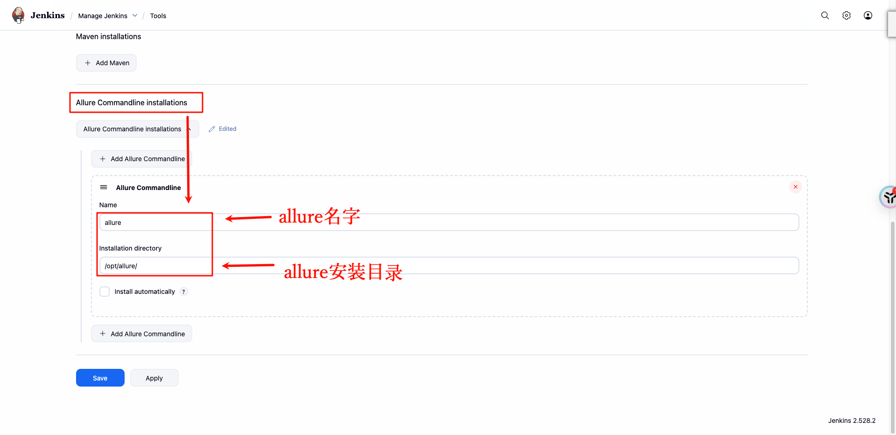

> 如果不清楚自己安装的allure目录，使用命令：`whereis allure`来查看：
>
> 此处的/opt/allure/bin/allure是/usr/local/bin/allure的软连接，软连接就类似于windows中的快捷方式，jenkins中填写的安装目录同样不包含bin目录
>
> ​	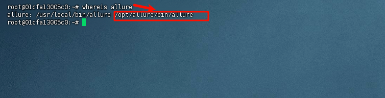


## 8.jenkins中job配置

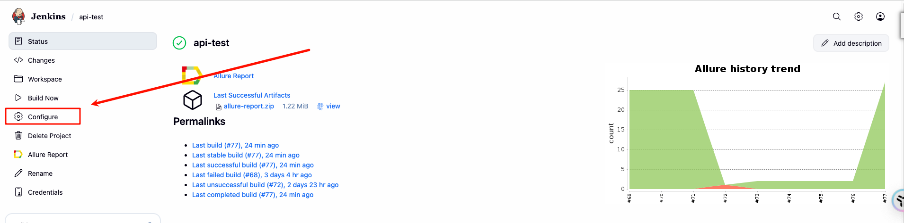

### 8.1.配置git

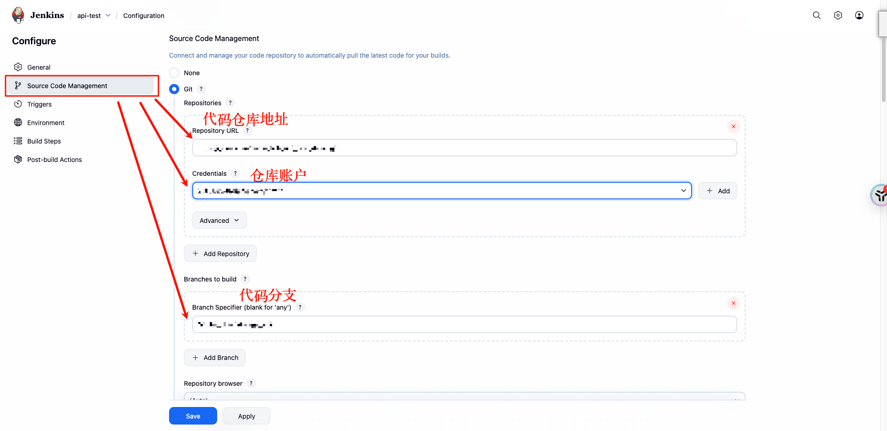


### 8.2.配置定时任务

每周周一到周五，上午九点和下午六点各执行一次

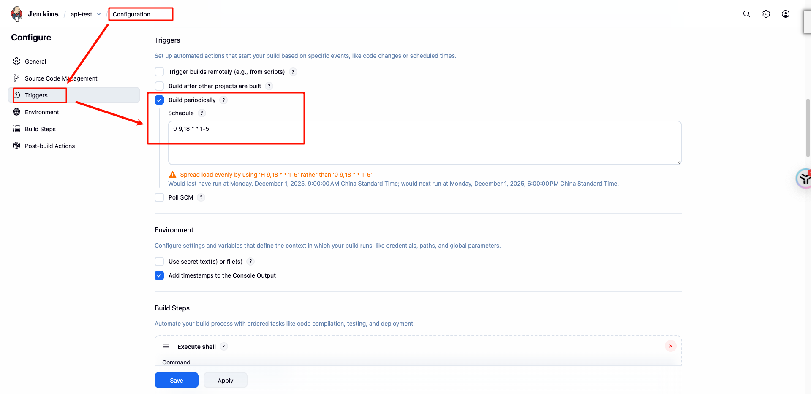


### 8.3.勾选时间配置

在控制台输出的时候显示出时间

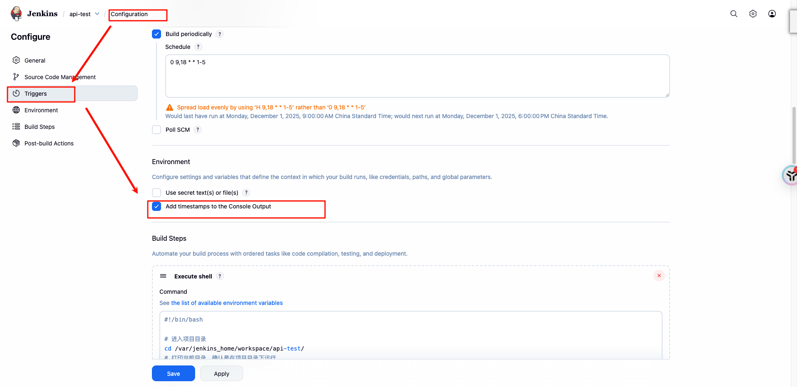


### 8.4.添加构建步骤

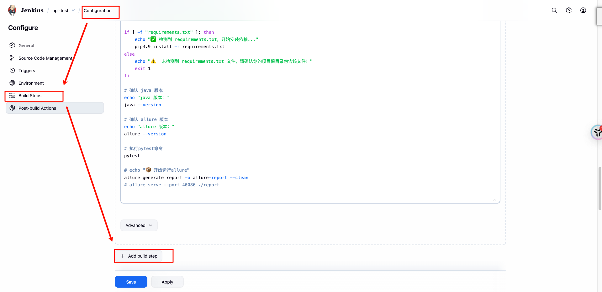

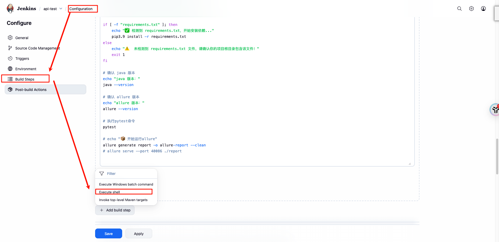

构建命令：

```shell
#!/bin/bash

# 进入项目目录
cd /var/jenkins_home/workspace/api-test/
# 打印当前目录，确认是在项目目录下运行
echo "📍 当前工作目录："
pwd

# 打印当前目录内容，确认代码已经拉取下来
echo "📂 当前目录文件列表："
ls -l

# 确认 Python 版本
echo "🐍 Python 版本："
python3.9 --version

# =============================================
# 步骤 1：创建 Python 虚拟环境（在项目目录下，路径：./venv）
# =============================================
VENV_DIR="./venv"  # 关键：使用项目目录下的 venv，不是 /opt/venv

echo "🔧 创建 Python 虚拟环境在：$VENV_DIR"
python3.9 -m venv "$VENV_DIR"

# 检查是否创建成功
if [ ! -d "$VENV_DIR" ]; then
    echo "❌ 虚拟环境创建失败！请检查 Python3 和 venv 模块是否正常。"
    exit 1
fi

echo "✅ 虚拟环境创建成功：$VENV_DIR"

# =============================================
# 步骤 2：激活虚拟环境
# =============================================
echo "🚀 激活虚拟环境..."
source "$VENV_DIR/bin/activate"

# =============================================
# 步骤 3：升级 pip（避免使用老版本 pip 安装依赖出错）
# =============================================
echo "🔼 升级 pip 到最新版..."
pip3.9  install --upgrade pip

# =============================================
# 步骤 4：安装项目依赖（从 requirements.txt）
# =============================================
echo "📦 开始安装 Python 依赖（来自 requirements.txt）..."

if [ -f "requirements.txt" ]; then
    echo "✅ 检测到 requirements.txt，开始安装依赖..."
    pip3.9 install -r requirements.txt
else
    echo "⚠️  未检测到 requirements.txt 文件，请确认你的项目根目录包含该文件！"
    exit 1
fi

# 确认 java 版本
echo "java 版本："
java --version

# 确认 allure 版本
echo "allure 版本："
allure --version

# 执行pytest命令
pytest

# echo "📦 开始运行allure"
allure generate report -o allure-report --clean
# allure serve --port 40086 ./report

```


### 8.5.配置allure测试报告路径

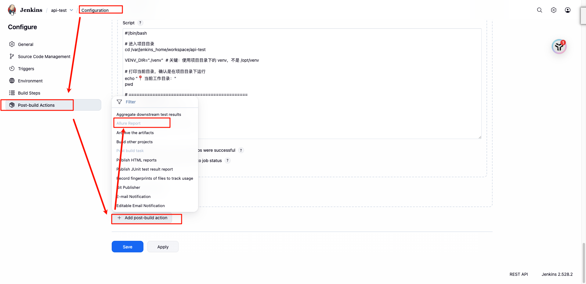

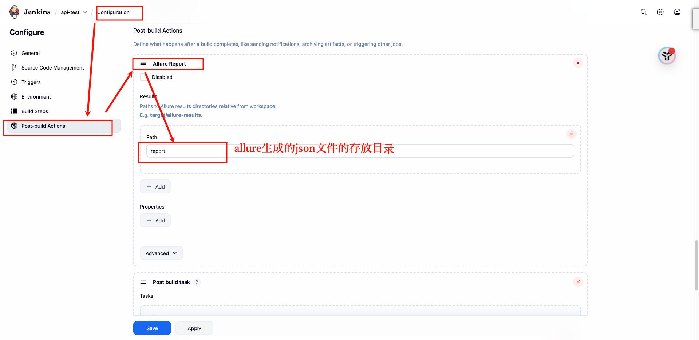


### 8.6.添加构建完毕之后的操作

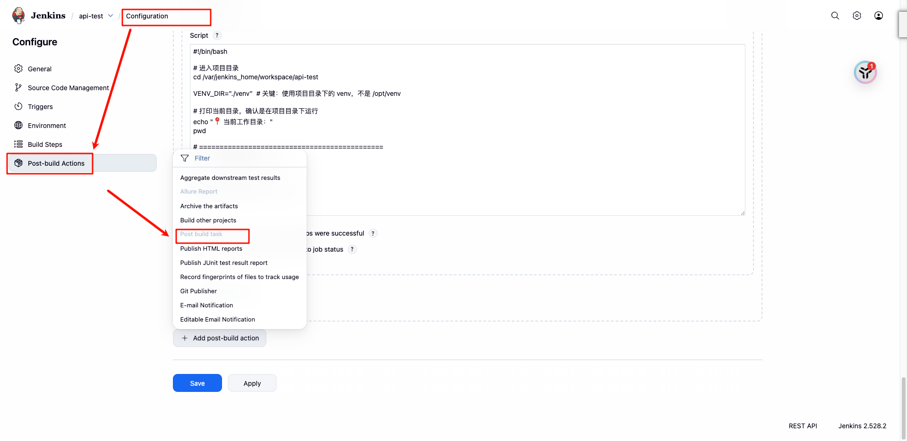

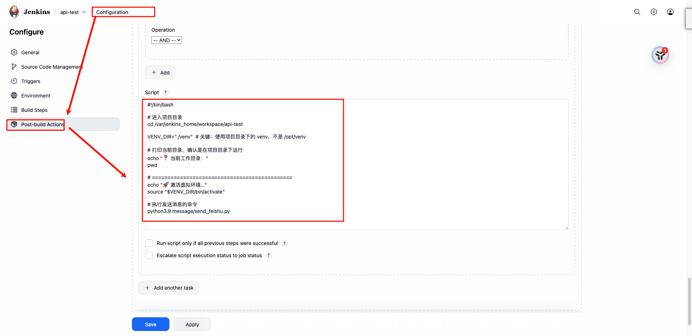

